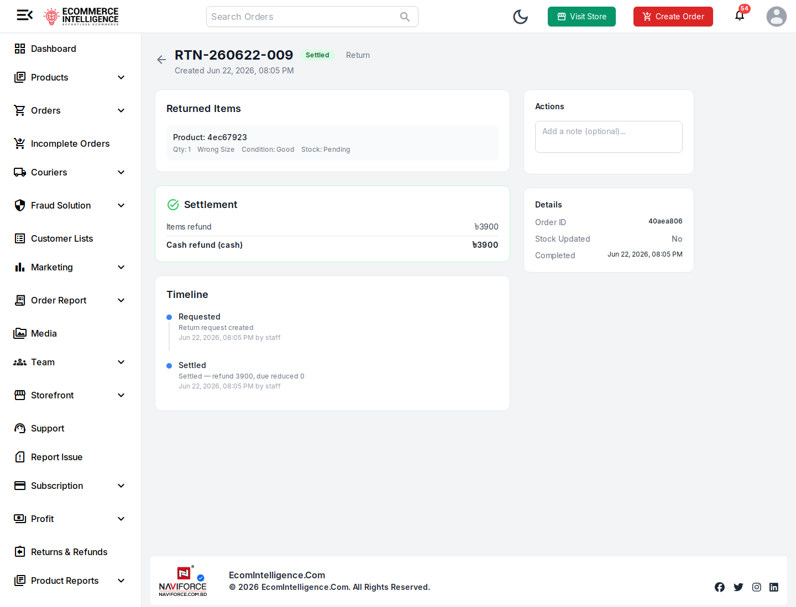
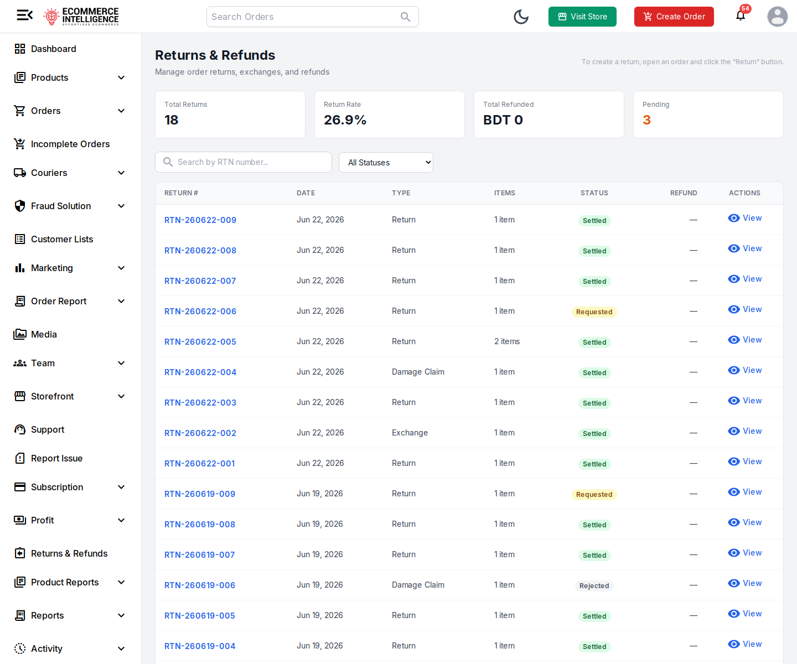
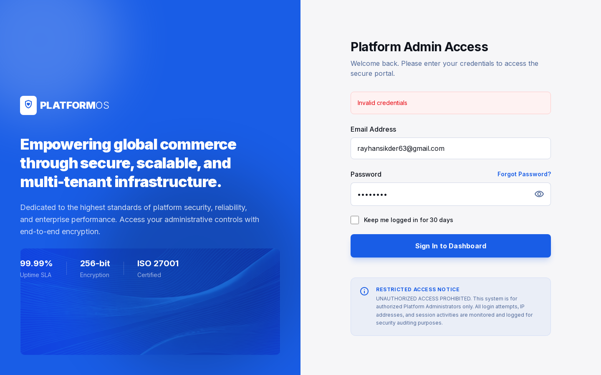

# Sikder Store — Return / Exchange / Damage Claim E2E Test Report

**Ticket:** Return, Exchange & Damage Claim workflow validation (Order, Inventory, Refund, Store Ops)  
**Environment:** Sandbox — storefront sk-store.myei.app, admin admin.myei.app/shop/sk-store; bKash & SSLCommerz in sandbox mode  
**Date:** 2026-06-22  
**Run:** 2026-06-23_002450

## Summary

| Total | Pass | Fail | Blocked | Skipped |
| ----- | ---- | ---- | ------- | ------- |
| 13 | 9 | 3 | 1 | 0 |

## Results

| TC | Title | Area | Status | Severity | Priority |
| -- | ----- | ---- | ------ | -------- | -------- |
| TC-6 | Settling a Return does NOT restock the returned item | Inventory | FAIL | High | High |
| TC-7 | bKash / digital refund is recorded as a Cash refund | Refund | FAIL | High | Medium |
| TC-8 | Returns dashboard "Total Refunded" KPI and REFUND column show 0 / blank | Refund | FAIL | Medium | Medium |
| TC-9 | Settling an Exchange spawns a linked replacement order | Exchange | PASS | Medium | Medium |
| TC-10 | Damage Claim captures condition + photos and is recorded | Damage | PASS | Medium | Medium |
| ENV-1 | Provided Admin Portal URL rejects the supplied credentials | Environment | BLOCKED | Medium | High |
| TC-12 | Returns status filter — usability observation | Return | PASS | Low | Low |
| TC-1 | Storefront orders reach All Orders | Order | PASS | - | High |
| TC-2 | Order status transitions are logged | Order | PASS | - | High |
| TC-3 | Return action is gated by order status | Return | PASS | - | High |
| TC-4 | Create Return request on a Delivered order | Return | PASS | - | High |
| TC-5 | Settle Return adjusts refund / due and order status | Return | PASS | - | High |
| TC-11 | A return request can be rejected | Return | PASS | - | Medium |

## Defects (Failed / Blocked)

### TC-6 — Settling a Return does NOT restock the returned item

- **Area:** Inventory
- **Severity:** High | **Priority:** High | **Status:** FAIL

**Steps to reproduce:**

1. Open Returns & Refunds
2. Open a Settled Return-type record (e.g. RTN-260622-009)
3. Read the Settlement panel + Details → "Stock Updated"
4. Cross-check the product in Inventory → Stock Overview

**Expected:** After a Return-type return is settled (items physically come back), the item is restocked and the return shows "Stock Updated: Yes".

**Actual:** On settled returns the Detail panel shows "Stock Updated: No" and the returned line shows "Stock: Pending" — inventory is never incremented. Verified on RTN-260622-009 (and the same on every settled return/exchange). Returned stock is lost.

**Evidence:**

### TC-7 — bKash / digital refund is recorded as a Cash refund

- **Area:** Refund
- **Severity:** High | **Priority:** Medium | **Status:** FAIL

**Steps to reproduce:**

1. Identify a settled return for a bKash-paid order (order 50000072 / RTN-260622-009)
2. Open the return detail
3. Inspect the Settlement refund method

**Expected:** A bKash-paid (prepaid/digital) order refunds through the original method; settlement must not record a digital refund as 'cash'.

**Actual:** RTN-260622-009 settles a bKash-paid order (50000072) yet the Settlement panel records "Cash refund (cash) ৳3900". Digital refunds are mislabelled/misrouted as cash, corrupting reconciliation.

**Evidence:**

### TC-8 — Returns dashboard "Total Refunded" KPI and REFUND column show 0 / blank

- **Area:** Refund
- **Severity:** Medium | **Priority:** Medium | **Status:** FAIL

**Steps to reproduce:**

1. Open Returns & Refunds
2. Read the "Total Refunded" KPI card
3. Read the REFUND column for settled rows

**Expected:** The Returns & Refunds "Total Refunded" KPI and the REFUND column reflect the actual settled refund amounts.

**Actual:** With multiple settled returns refunding ৳3900, ৳1200, etc., the dashboard header still reads "Total Refunded: BDT 0" and every row's REFUND column shows "—". Refund reporting is non-functional.

**Evidence:**

### ENV-1 — Provided Admin Portal URL rejects the supplied credentials

- **Area:** Environment
- **Severity:** Medium | **Priority:** High | **Status:** BLOCKED

**Steps to reproduce:**

1. Open https://platform-admin.myei.app/login
2. Sign in with the Store Owner credentials
3. Observe 401 Invalid credentials
4. Open https://sk-store.myei.app/admin → redirects to admin.myei.app/shop/sk-store → login succeeds

**Expected:** The Store Owner / Admin User credentials authenticate at the documented Admin Portal (platform-admin.myei.app).

**Actual:** platform-admin.myei.app/login → POST /api/v1/auth/admin/login returns 401 "Invalid credentials" for BOTH accounts. Order management actually lives in the EcomIntelligence dashboard at admin.myei.app/shop/sk-store (staff login, /api/v1/auth/staff/login), reached via sk-store.myei.app/admin. Ticket documentation points testers to the wrong portal.

**Evidence:**

